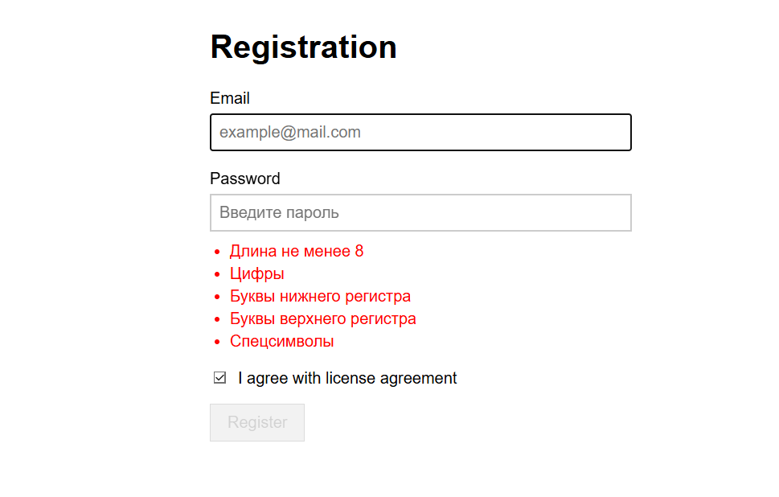

# часть 1 -  VeeValidate
# часть 2 -  Routing
# часть 3 -  Pinia
  

работа с валидацией форм во Vue 3 с использованием библиотеки **VeeValidate**.

1. Реализация формы регистрации с валидацией.

---

# Часть 1. Форма регистрации с VeeValidate

- `email`;
- `password`;
- checkbox `I agree with license agreement`.

валидация с использованием библиотеки **VeeValidate**.

## Реализованный функционал

В форме реализованы следующие проверки.

### Email

Поле `email` должно содержать корректный email-адрес.

Если email введён некорректно, поле подсвечивается красной рамкой. Если email корректный — зелёной рамкой. Пустое поле не подсвечивается.

### Password

Поле `password` должно соответствовать:

- длина не менее 8 символов;
- наличие цифры;
- наличие буквы нижнего регистра;
- наличие буквы верхнего регистра;
- наличие спецсимвола.

Выполненные критерии подсвечиваются зелёным цветом, невыполненные — красным.

### License agreement

Для завершения регистрации пользователь должен отметить checkbox:

```text
I agree with license agreement
```

Без отметки этого пункта кнопка регистрации остаётся неактивной.

## Поведение кнопки регистрации

Кнопка `Register` становится активной только при выполнении всех условий:

- email заполнен корректно;
- пароль соответствует всем критериям;
- checkbox согласия отмечен.

Если хотя бы одно условие не выполнено, кнопка остаётся неактивной.

## Структура проекта

```text
VeeValidate/
├── public/
├── src/
│   ├── App.vue
│   ├── main.js
│   └── style.css
```

##  файлы

### `src/App.vue`

В нём находится:

- разметка формы регистрации;
- подключение `useForm` и `useField`;
- функции валидации email, password и checkbox;
- логика активации кнопки регистрации;
- список критериев пароля.


Запустить проект:

```bash
npm run dev
```

---
---

1. **Routing** — добавление маршрутов для разных страниц приложения.
2. **Pinia** — перенос состояния задач в централизованное хранилище.

Приложение работает без сервера. Все задачи сохраняются в браузере через `LocalStorage`.

---

# Часть 2. Routing

## Основная идея

В Routing-части TodoList был сделан как одностраничное приложение с разными URL-адресами.

Пользователь может переходить между страницами, но сайт не перезагружается полностью. За переходы отвечает **Vue Router**.

## Реализованные маршруты

В приложении используются следующие маршруты:

```text
/                     список всех задач
/add                  добавление новой задачи
/task/<id>            просмотр конкретной задачи
/task/<id>/delete     удаление задачи
/task/<id>/complete   изменение статуса задачи
/about                страница "О нас"
```

Например, задача с `id = 1` открывается по адресу:

```text
/task/1
```

Удаляется по адресу:

```text
/task/1/delete
```

А её статус меняется по адресу:

```text
/task/1/complete
```

## Работа с задачами

Каждая задача имеет простую структуру:

```js
{
  id: 1,
  title: 'Example task',
  completed: false
}
```

Где:

- `id` — уникальный номер задачи;
- `title` — название задачи;
- `completed` — статус выполнения.

При создании новой задачи ей автоматически присваивается новый `id`.

## LocalStorage

Задачи сохраняются в `LocalStorage`.

Это нужно для того, чтобы после обновления страницы список задач не пропадал.

Логика работы:

1. При запуске приложения задачи загружаются из `LocalStorage`.
2. Если задач нет, используется пустой список.
3. При добавлении, удалении или изменении статуса список обновляется.
4. После изменения новый список снова сохраняется в `LocalStorage`.

## Основные файлы Routing-части

```text
src/
├── router/
│   └── index.js
├── views/
│   ├── TaskListView.vue
│   ├── AddTaskView.vue
│   ├── TaskDetailsView.vue
│   ├── DeleteTaskView.vue
│   ├── CompleteTaskView.vue
│   └── AboutView.vue
├── App.vue
└── main.js
```

### `src/router/index.js`

Файл с настройкой маршрутов.

Он определяет, какой компонент должен открываться по конкретному адресу.

### `TaskListView.vue`

Страница списка задач.

На ней отображаются все задачи, а также доступны действия:

- открыть задачу;
- отметить задачу как выполненную;
- удалить задачу.

### `AddTaskView.vue`

Страница добавления задачи.

После добавления задача сохраняется и пользователь возвращается на главную страницу.

### `TaskDetailsView.vue`

Страница конкретной задачи.

На ней отображаются `id`, название и статус задачи.

### `DeleteTaskView.vue`

Страница удаления задачи.

При переходе на `/task/<id>/delete` задача удаляется, после чего выводится сообщение:

```text
Task deleted
```

### `CompleteTaskView.vue`

Страница изменения статуса задачи.

При переходе на `/task/<id>/complete` статус задачи меняется, после чего выводится сообщение:

```text
Task status has been changed
```

### `AboutView.vue`

Страница с кратким описанием приложения.

---

# Часть 3. State Management: Pinia

## Основная идея

В Pinia-части TodoList был доработан так, чтобы состояние задач хранилось в **Pinia Store**.

До этого список задач мог храниться в отдельном composable-файле. После доработки все задачи находятся в одном централизованном хранилище.

## Что хранится в Pinia

В Pinia State хранится список задач:

```js
state: () => ({
  tasks: loadTasks(),
})
```

`tasks` — это массив всех задач приложения.

При запуске приложения задачи загружаются из `LocalStorage`.

## Actions

Все изменения задач выполняются через Pinia Actions.

Основные actions:

```text
addTask(title)       добавляет новую задачу
deleteTask(id)       удаляет задачу
completeTask(id)     меняет статус задачи
getTaskById(id)      возвращает задачу по id
saveTasks()          сохраняет задачи в LocalStorage
```

## Как работает добавление задачи

При добавлении задачи вызывается action:

```js
taskStore.addTask(title)
```

Она:

1. Проверяет, что название задачи не пустое.
2. Создаёт новую задачу.
3. Добавляет её в `tasks`.
4. Сохраняет обновлённый список в `LocalStorage`.

## Как работает удаление задачи

При удалении вызывается action:

```js
taskStore.deleteTask(id)
```

Она удаляет задачу с указанным `id` и сохраняет новый список задач.

## Как работает изменение статуса

При изменении статуса вызывается action:

```js
taskStore.completeTask(id)
```

Если задача была невыполненной, она становится выполненной. Если была выполненной — становится невыполненной.

## Основной файл Pinia

```text
src/stores/taskStore.js
```

В этом файле находится:

- состояние `tasks`;
- загрузка задач из `LocalStorage`;
- сохранение задач в `LocalStorage`;
- actions для работы с задачами.

## Использование store в компонентах

В компонентах store подключается так:

```js
import { useTaskStore } from '../stores/taskStore'

const taskStore = useTaskStore()
```

После этого можно обращаться к состоянию и actions:

```js
taskStore.tasks
taskStore.addTask(title)
taskStore.deleteTask(id)
taskStore.completeTask(id)
taskStore.getTaskById(id)
```

## Зачем нужен Pinia

Pinia делает состояние приложения централизованным.

Это удобно, потому что разные страницы работают с одним и тем же списком задач:

- `/` показывает задачи;
- `/add` добавляет задачу;
- `/task/<id>` показывает конкретную задачу;
- `/task/<id>/delete` удаляет задачу;
- `/task/<id>/complete` меняет статус задачи.

Все эти страницы используют один общий store.

---

# Запуск проекта

Установить зависимости:

```bash
npm install
```

Запустить проект:

```bash
npm run dev
```

После запуска открыть адрес, который появится в терминале, например:

```text
http://localhost:5173/
```

---

# Проверка работы

## Routing

Проверить следующие адреса:

```text
http://localhost:5173/
http://localhost:5173/add
http://localhost:5173/task/1
http://localhost:5173/task/1/delete
http://localhost:5173/task/1/complete
http://localhost:5173/about
```

## Pinia

Проверить, что:

1. Задача добавляется через `/add`.
2. Задача появляется на главной странице.
3. После обновления страницы задача не исчезает.
4. Статус задачи можно изменить.
5. Задачу можно удалить.
6. Все изменения сохраняются в `LocalStorage`.

---

